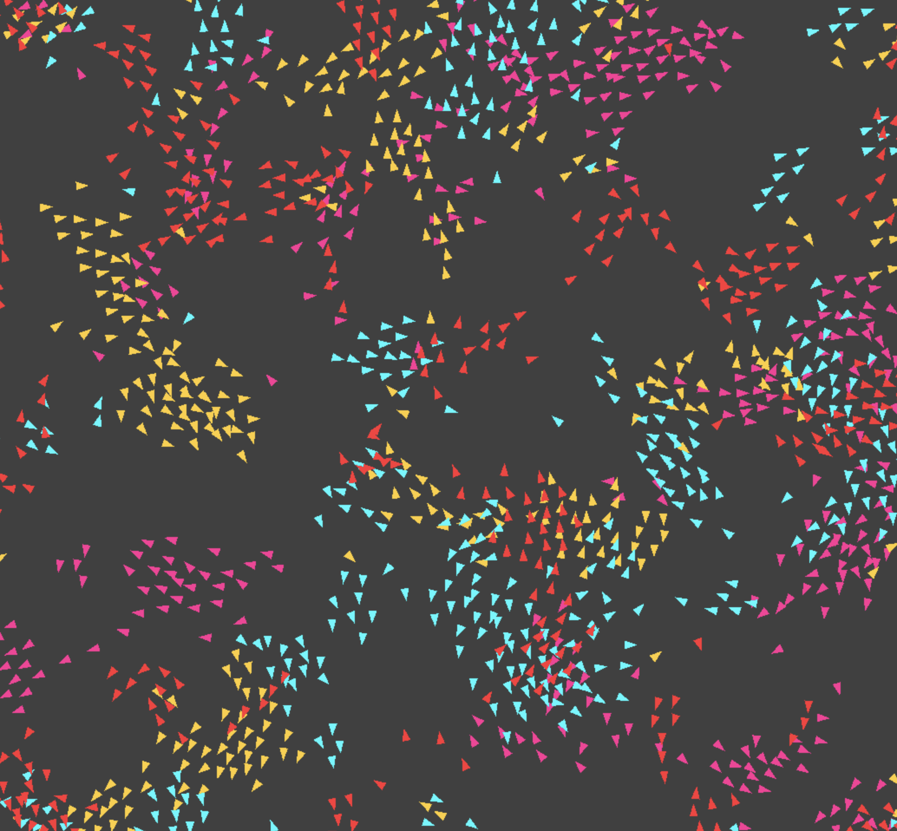

# Boid Playground



## Prerequisites

- SDL3 installed on your system

## Build Commands

```bash
# Build the project
zig build

# Run the application
zig build run

# Check compilation without running
zig build check
```
